<p align="center">
  <picture>
    <source media="(max-width: 600px)" srcset="./assets/hero-mobile.svg" />
    
  </picture>
</p>

<p align="center">
  
  <a href="https://github.com/fanyqe?tab=repositories">
    
  </a>
  
</p>

## Product-minded engineer

I'm `fanyqe`. I design and ship production-grade web and mobile products—from API
contracts and data models to polished interfaces and dependable deployments. I care
about systems that are secure by default, observable in production, and pleasant to use.

```text
role        product-minded full-stack engineer
scope       web · mobile · APIs · infrastructure
standard    secure · observable · maintainable
delivery    own the outcome, not just the ticket
```

## Languages

<p>
  
  
  
  
  
  
  
  
  
  
  
  
  
  
  
  
  
  
  
  
  
  
  
</p>

## Web, backend & data

<p>
  
  
  
  
  
  
  
  
  
  
  
  
  
  
  
  
  
</p>

## Mobile & Android

<p>
  
  
  
  
  
  
  
  
</p>

## IDEs & development environments

<p>
  
  
  
  
  
  
  
  
</p>

## Infrastructure & tooling

<p>
  
  
  
  
  
  
  
  
  
  
  
</p>

## Engineering principles

- **End-to-end ownership:** architecture, implementation, deployment, and iteration
- **Production discipline:** secure defaults, observability, safe rollbacks, and test evidence
- **Integration depth:** stable contracts across APIs, data, queues, payments, and third parties
- **Product judgment:** clear interfaces, mobile-first decisions, and measurable outcomes

## Engineering activity

<p align="center">
  <picture>
    <source media="(prefers-color-scheme: dark)" srcset="https://raw.githubusercontent.com/fanyqe/fanyqe/gh-pages/github-contribution-grid-snake-dark.svg" />
    <source media="(prefers-color-scheme: light)" srcset="https://raw.githubusercontent.com/fanyqe/fanyqe/gh-pages/github-contribution-grid-snake.svg" />
    
  </picture>
</p>

---

<p align="center">
  <sub><code>build quietly · ship clearly · improve relentlessly</code></sub>
</p>
